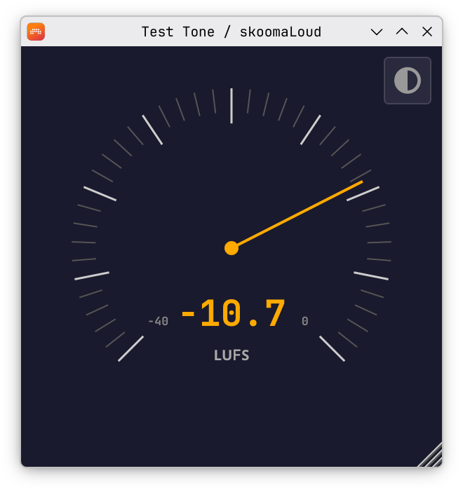
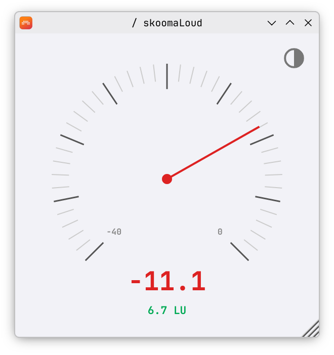

# skoomaLoud

A minimal VST3 loudness meter.

<table><tr>
<td></td>
<td></td>
</tr></table>

Short-term LUFS (ITU-R BS.1770-4, 3-second sliding window) on a single needle. Dark and light themes. Spring-damped needle physics.

## Install

Download the VST3 for your platform from the [Releases](https://github.com/skoomabwoy/SkoomaLoud/releases) page.

- **Linux**: Extract the `.zip` and copy `skoomaLoud.vst3` to `~/.vst3/` or `/usr/lib/vst3/`.
- **Windows**: Extract the `.zip` and copy `skoomaLoud.vst3` to `C:\Program Files\Common Files\VST3\`.
- **macOS**: Open the `.dmg`, drag `skoomaLoud.vst3` into the `VST3 Plug-Ins` folder, then run `xattr -cr ~/Library/Audio/Plug-Ins/VST3/skoomaLoud.vst3` in Terminal. This is needed because the plugin is unsigned (we don't want to pay $99/year for a free plugin).

<details>
<summary>Alternatively, you can build from source</summary>

CMake 3.22+, C++17 compiler. JUCE is fetched automatically.

```bash
cmake -B build -DCMAKE_BUILD_TYPE=Release
cmake --build build -j$(nproc)
```

Copy `build/SkoomaLoud_artefacts/Release/VST3/skoomaLoud.vst3/` to your VST3 folder.

</details>

## Credits

K-weighting and short-term integration implemented from scratch against the [ITU-R BS.1770-4](https://www.itu.int/rec/R-REC-BS.1770) loudness specification, using biquad design formulas from Robert Bristow-Johnson's [Audio EQ Cookbook](https://www.w3.org/TR/audio-eq-cookbook/). Icons: [Font Awesome Free](https://fontawesome.com/) (SIL OFL 1.1). Font: [JetBrains Mono](https://www.jetbrains.com/lp/mono/) (SIL OFL 1.1).

## License

GPL-3.0
